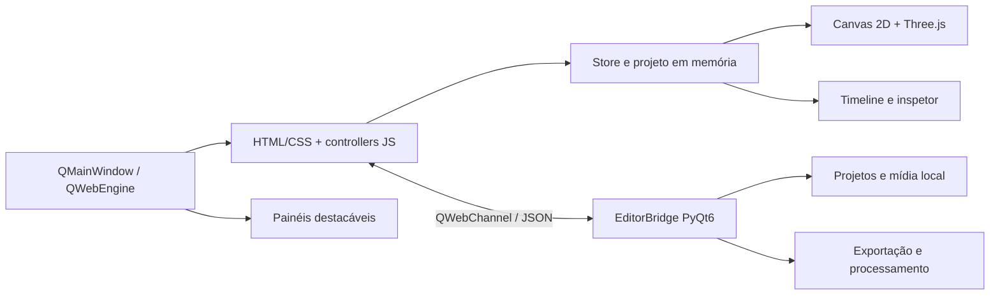

# Lumi Motion

Editor desktop de vídeo e motion graphics construído com PyQt6, QWebEngine, HTML Canvas, JavaScript e FFmpeg. O Lumi combina uma interface web local com acesso nativo a arquivos, projetos e janelas do sistema operacional.

Landing page: https://guell11.github.io/Lumi-motion/

> O projeto está em desenvolvimento ativo. A documentação abaixo diferencia os recursos implementados das limitações conhecidas para facilitar manutenção e planejamento.

## O que já é possível fazer

### Edição e composição

- Importar vários vídeos, imagens, áudios, GIFs, SVGs e fontes de uma vez.
- Arrastar mídia da biblioteca diretamente para uma pista compatível da timeline.
- Selecionar, mover, redimensionar e rotacionar elementos no canvas.
- Selecionar vários elementos com uma caixa de seleção no canvas ou na timeline.
- Mover vários clips selecionados preservando a distância temporal entre eles.
- Trabalhar com texto 2D, texto 3D, formas, mídia e elementos SVG.
- Editar texto diretamente no canvas com duplo clique.
- Controlar ordem Z, opacidade, blur, blend mode, máscaras, stroke e sombras.

### Timeline

- Pistas estáveis para vídeo, texto, shapes/SVG e áudio.
- Vários clips na mesma pista, sem criar uma lane por camada.
- Drag incremental com `requestAnimationFrame`, sem reconstruir toda a timeline a cada pixel.
- Seleção múltipla por `Shift`, `Ctrl+A` e marquee, como na área de trabalho.
- Trim pelas bordas preservando `sourceIn` da mídia.
- Split no playhead, duplicação, exclusão, união e marcadores de beat.
- Snapping em bordas, playhead e marcadores, com guia visual.
- Zoom centrado no cursor, ajuste à largura e auto-scroll durante drag.
- Pistas com bloqueio e visibilidade.
- Timeline redimensionável, recolhível e destacável em outra janela/monitor.

### Animação e motion design

- Keyframes por propriedade com interpolação e easing.
- Auto Key: mova o playhead e altere uma propriedade para criar ou atualizar o keyframe naquele tempo.
- Caminhos de movimento lineares e Bezier editáveis no canvas.
- Presets de entrada, saída, escala, rotação, shake, glow, glitch, 3D e texto animado.
- Animações de câmera: pan, dolly, zoom, roll, tilt, FOV e presets de movimento.
- Animações de cursor, clique, hover, arraste, swipe e demonstrações de interface.
- Texto animado por letra ou palavra, incluindo typewriter, bounce, glitch, neon, blur, scramble e wave.

### Templates e formatos sociais

- 63 templates transacionais de motion graphics em 11 categorias.
- Lower thirds, openers, captions, logo reveals, callouts, scoreboards, end cards e sistemas de identidade.
- Packs de produto, evento, creator, podcast e tecnologia.
- Templates de cursor/clique e demonstração de interações.
- Composições para TikTok, Reels, Stories, Shorts, feed 1:1 e feed 4:5.
- Formatos de projeto 16:9, 9:16, 1:1 e 4:5.
- Preview opcional de interface e safe zones de TikTok, Reels e Shorts; o overlay é apenas de referência e não entra no arquivo exportado.
- Aplicação de template em uma transação: um único Undo remove toda a composição criada.

### SVG e cor

- Biblioteca interna de SVGs para cursores, cliques, setas, badges, logos e elementos de interface.
- Importação de SVG externo como mídia.
- Recolorização em três modos: original, monocromático e duotone.
- Cores primária/secundária, stroke e espessura configuráveis.
- Ajustes de exposição, brilho, contraste, highlights, shadows, saturação, vibrance, temperatura, tint, grain e chroma.

### Áudio

- Áudio separado ou faixa de áudio de clips de vídeo.
- Volume, fade-in, fade-out, velocidade, pitch e pan.
- EQ de graves, médios e agudos, reverb, compressor e limiter.
- Normalização, enhancement e redução de ruído no pipeline FFmpeg.
- Extração de áudio de vídeo e geração de áudio de preview.

### Interface e múltiplos monitores

- Layout em três áreas: biblioteca, player e inspetor, com timeline inferior.
- Painéis laterais e timeline redimensionáveis; inspetor recolhível.
- Player, timeline e inspetor podem ser destacados em janelas nativas.
- A janela destacada pode ser arrastada para outro monitor e acoplada novamente.
- Busca por mídia, presets, templates e elementos com normalização de acentos.
- Tema grafite sólido, com foco em legibilidade e custo gráfico baixo.
- Modos de acessibilidade do sistema para movimento, transparência, contraste e cores forçadas.

### Projeto e exportação

- Projetos JSON com extensão `.lumi.json`.
- Hub para projeto novo, abertura e lista de projetos recentes.
- Autosave a cada 10 segundos após criar ou abrir um projeto.
- Exportação MP4/H.264 e GIF por sequência de PNGs + FFmpeg.
- Resoluções 720p, 1080p e 4K; 24, 30 e 60 fps; bitrate configurável.
- Mix de áudio com trim, atraso na timeline, fades e filtros.

## Captura de tela


## Requisitos

- Windows 10/11 recomendado.
- Python 3.11 ou mais recente.
- PyQt6 e PyQt6-WebEngine 6.7+.
- FFmpeg para exportação final, áudio de vídeo e thumbnails.
- GPU com suporte a aceleração Chromium/WebGL recomendada para texto 3D e projetos pesados.

## Instalação e execução no Windows

Instale o [Python 3.11 ou mais recente](https://www.python.org/downloads/windows/) e marque `Add Python to PATH` durante a instalação. Depois, dê duplo clique em `run_editor.bat` ou execute:

```powershell
.\run_editor.bat
```

O launcher:

1. Procura Python pelo `py`, `python` ou `python3`.
2. Cria o ambiente isolado `.venv` na primeira execução.
3. Instala os pacotes de `requirements.txt` quando necessário.
4. Abre o editor e mantém mensagens de erro visíveis caso algo falhe.

Na primeira execução é necessário acesso à internet para baixar PyQt6. O Python não vem incluído no repositório.

### Execução manual

```powershell
git clone https://github.com/guell11/Lumi-motion.git
cd Lumi-motion
py -3 -m venv .venv
.\.venv\Scripts\Activate.ps1
python -m pip install -r .\requirements.txt
python .\app.py
```

Se o PowerShell bloquear `Activate.ps1`, não é necessário alterar a política de execução. Use os executáveis diretamente:

```powershell
.\.venv\Scripts\python.exe -m pip install -r .\requirements.txt
.\.venv\Scripts\python.exe .\app.py
```

O editor abre a interface local em `web/index.html`; nenhuma conexão com servidor é necessária.

### FFmpeg

O app procura o executável nesta ordem:

1. `ffmpeg` disponível no `PATH`.
2. `tools/ffmpeg/bin/ffmpeg.exe`.
3. `tools/ffmpeg/ffmpeg.exe`.
4. `ffmpeg.exe` na raiz do projeto.
5. Binário fornecido por `imageio-ffmpeg`.

O `ffprobe` segue busca semelhante para duração e presença de áudio. Sem FFmpeg, a edição visual abre normalmente, mas exportação final, extração de áudio e geração de alguns previews ficam indisponíveis.

### Fallback de renderização

A aceleração de GPU fica ligada por padrão. Em máquinas com driver Chromium incompatível, use renderização por software apenas para diagnóstico:

```powershell
$env:LUMI_SOFTWARE_RENDERING = "1"
python app.py
```

Esse modo é mais lento e não deve ser o padrão em uma GPU funcional.

## Fluxo básico

1. Crie ou abra um projeto no hub.
2. Importe um ou vários arquivos no painel de mídia.
3. Arraste os cards para a pista correta da timeline.
4. Selecione um elemento e ajuste propriedades no inspetor.
5. Ative Auto Key, mova o playhead e altere propriedades para animar.
6. Aplique presets/templates ou edite curvas e caminhos de movimento.
7. Escolha o formato do canvas e, se necessário, ative um preview social.
8. Exporte em MP4 ou GIF.

## Atalhos

| Atalho | Ação |
| --- | --- |
| `Space` | Play/pause |
| `Ctrl+S` | Salvar projeto |
| `Ctrl+Z` / `Ctrl+Y` | Desfazer/refazer |
| `Ctrl+D` | Duplicar camada selecionada |
| `Ctrl+A` | Selecionar tudo na região sob o mouse |
| `Ctrl+K` | Focar a pesquisa |
| `Delete` / `Backspace` | Excluir seleção |
| `S` | Cortar clip no playhead |
| `V` | Ferramenta de seleção |
| `B` | Lâmina |
| `←` / `→` | Voltar/avançar um frame |
| `Shift+←` / `Shift+→` | Voltar/avançar dez frames |
| `Home` / `End` | Início/fim do conteúdo |
| `J` / `K` / `L` | Navegação para trás, pausa e reprodução |

Atalhos globais não interceptam campos de formulário nem edição de texto no canvas.

## Arquitetura em uma visão



O frontend usa scripts IIFE carregados em ordem e publica módulos no namespace global `window.Editor`. O `Store` é a fonte de verdade do projeto; controllers reagem a razões de mudança como `time`, `layer:add` ou `timeline:drag-live`. O backend Python é acessado somente pelo adapter `Editor.Bridge`.

## Estrutura do repositório

```text
Lumi-motion/
├── app.py                    Entrada da aplicação desktop
├── index.html                Landing page estática
├── editor/
│   ├── main_window.py        Janela, WebEngine, QWebChannel, drop e popups
│   ├── bridge.py             API Python exposta ao JavaScript
│   ├── exporter.py           Sessões de frames e comandos FFmpeg
│   ├── media.py              Classificação e metadata de mídia
│   ├── project.py            Defaults, normalização e persistência JSON
│   └── paths.py              Diretórios de projeto/export/temp
├── web/
│   ├── index.html            Shell do editor e ordem dos scripts
│   ├── styles.css            Tokens, layout e estados visuais
│   ├── vendor/three.module.js
│   └── js/                   Store e controllers do frontend
├── docs/                     Documentação técnica detalhada
├── projects/                 Criado em runtime
├── autosaves/                Criado em runtime
├── exports/                  Criado em runtime
└── .tmp/                     Criado em runtime
```

## Documentação de engenharia

- [Índice técnico](docs/README.md)
- [Arquitetura e fluxo de dados](docs/ARCHITECTURE.md)
- [Formato `.lumi.json`](docs/PROJECT_FORMAT.md)
- [Estado, eventos, transações e Undo](docs/STATE_AND_COMMANDS.md)

## Limitações conhecidas

- A exportação de composição gera PNGs no frontend e envia cada frame pelo QWebChannel; é correta para o modelo atual, mas cara em 4K/60 e ainda não tem worker/cancelamento completo no backend.
- Comandos FFmpeg finais são síncronos no processo Python; uma exportação pesada pode reduzir a responsividade da janela.
- O sistema de módulos é baseado em scripts globais/IIFE, sem bundler ou checagem estática de tipos.
- Não há suíte automatizada versionada no estado atual do repositório.
- Arquivos de projeto guardam caminhos locais absolutos e ainda não possuem relink/proxy portátil.
- O popout multi-monitor depende do suporte de janelas do QWebEngine e deve ser testado nos drivers/monitores do ambiente de entrega.
- A mudança de proporção altera o canvas, mas não reposiciona automaticamente composições antigas.

## Licença

Consulte [LICENSE](LICENSE).
