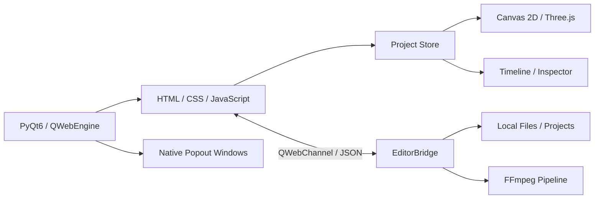

<div align="center">

# Lumi Motion

### Desktop video editing and motion graphics, built around a fast canvas + timeline workflow.

Create, animate, composite and export videos without leaving the desktop.

[](https://www.python.org/)
[](https://www.riverbankcomputing.com/software/pyqt/)
[](https://ffmpeg.org/)
[](https://threejs.org/)
[](https://www.microsoft.com/windows)
[](LICENSE)
[](https://github.com/guell11/Lumi-motion/stargazers)

<br>

[**Website**](https://guell11.github.io/Lumi-motion/) ·
[**Getting Started**](#getting-started) ·
[**Features**](#features) ·
[**Documentation**](#documentation)

</div>

---

## Motion design without the heavyweight workflow


**Lumi Motion** is an open-source desktop editor for video editing, animation and motion graphics.

It combines a web-based rendering interface with native desktop capabilities through **PyQt6, QWebEngine, JavaScript, HTML Canvas, Three.js and FFmpeg**.

Import media, build compositions, animate properties with keyframes, work with motion paths and templates, mix audio and export the final result from the same project.

No remote server is required. The editor runs locally.

> **Lumi is under active development.** Features described here are implemented unless explicitly listed under known limitations.

---

## Preview


---

## Features

<table>
<tr>
<td width="50%" valign="top">

### Video Editing

Import video, images, audio, GIFs, SVGs and fonts.

Trim, split, duplicate, join and arrange clips using a multi-track timeline with snapping, markers and multi-selection.

</td>
<td width="50%" valign="top">

### Motion Graphics

Animate properties with keyframes, easing and Auto Key.

Build motion using editable linear and Bezier paths, animation presets and per-letter or per-word text effects.

</td>
</tr>

<tr>
<td width="50%" valign="top">

### Canvas & Composition

Position, scale and rotate elements directly on the canvas.

Work with text, shapes, SVGs, media and 3D text alongside opacity, masks, blur, blend modes, strokes and shadows.

</td>
<td width="50%" valign="top">

### Camera Animation

Create pan, dolly, zoom, roll, tilt and FOV animations.

Camera movement presets make it possible to build dynamic compositions without manually animating every parameter.

</td>
</tr>

<tr>
<td width="50%" valign="top">

### Templates

Use **63 motion graphics templates across 11 categories**.

Includes lower thirds, openers, captions, logo reveals, callouts, scoreboards, end cards, product compositions and identity systems.

</td>
<td width="50%" valign="top">

### Social Formats

Create projects in:

**16:9 · 9:16 · 1:1 · 4:5**

Preview safe zones and interface overlays for TikTok, Reels and Shorts without including them in the exported video.

</td>
</tr>

<tr>
<td width="50%" valign="top">

### Audio

Control volume, fades, speed, pitch and stereo pan.

The FFmpeg pipeline also supports EQ, reverb, compression, limiting, normalization, enhancement and noise reduction.

</td>
<td width="50%" valign="top">

### Multi-Monitor Workflow

Detach the player, timeline or inspector into native windows.

Move panels to another display and dock them back into the main editor when needed.

</td>
</tr>
</table>

---

## Animation

Lumi is designed around property-based animation.

Set a keyframe, move the playhead and change the property. With **Auto Key** enabled, Lumi automatically creates or updates the keyframe at the current time.

Supported animation workflows include:

```text
Keyframes
├── Position
├── Scale
├── Rotation
├── Opacity
├── Effects
└── Camera properties

Motion Paths
├── Linear
└── Bezier

Presets
├── Entrance / Exit
├── Scale / Rotation
├── Shake
├── Glow / Glitch
├── 3D
├── Camera
└── Animated Text
```

Text can also be animated by **letter or word**, with effects such as typewriter, bounce, glitch, neon, blur, scramble and wave.

---

## Timeline

The timeline is built for editing without generating a separate lane for every layer.

```text
┌──────────────────────────────────────────────────────────────┐
│ Video    │ ████████       █████████████                     │
│ Text     │      █████████          ███████                  │
│ Shapes   │   ████████                     ████████          │
│ Audio    │ █████████████████████████████████████████        │
└──────────────────────────────────────────────────────────────┘
              ▲
           Playhead
```

It supports:

* Multiple clips on the same track
* Incremental drag updates using `requestAnimationFrame`
* Shift, marquee and `Ctrl+A` multi-selection
* Multi-clip movement while preserving relative timing
* Edge trimming with `sourceIn` preservation
* Split, duplicate, delete and join operations
* Beat markers
* Snapping to clips, markers and the playhead
* Visual snapping guides
* Cursor-centered zoom
* Fit-to-width
* Auto-scroll while dragging
* Track locking and visibility
* Resizable and detachable timeline

---

## SVG & Color

SVG is treated as a first-class asset type.

Lumi includes an internal SVG library for:

```text
Cursor       Click indicators
Arrows       Badges
Logos        UI elements
Callouts     Interaction graphics
```

External SVG files can also be imported as regular media.

SVG elements support three color modes:

| Mode       | Description                                 |
| ---------- | ------------------------------------------- |
| Original   | Preserve source colors                      |
| Monochrome | Replace artwork with a single color         |
| Duotone    | Map artwork to primary and secondary colors |

Primary color, secondary color, stroke color and stroke width can be adjusted from the editor.

---

## Color Controls

Lumi provides a set of image and video adjustments directly inside the composition workflow.


---

## Cursor & UI Motion

Lumi can create motion graphics specifically for product demos, tutorials and interface videos.

Built-in animation workflows include:


These can be combined with motion paths, easing, SVG assets and templates.

---

## Export

Projects can currently be exported as:

| Format | Pipeline              |
| ------ | --------------------- |
| MP4    | H.264 via FFmpeg      |
| GIF    | PNG sequence + FFmpeg |

Available output resolutions:


Available frame rates:


Bitrate is configurable.

Audio is mixed during export with timeline offsets, trimming, fades and FFmpeg filters.

---

## Getting Started

### Requirements


**Windows 10 or Windows 11 is currently recommended.**

A GPU with Chromium/WebGL acceleration is recommended for 3D text and heavier projects.

---

### Quick Start

Install **Python 3.11 or newer** and enable `Add Python to PATH` during installation.

Clone the repository:

```powershell
git clone https://github.com/guell11/Lumi-motion.git
cd Lumi-motion
```

The easiest way to launch Lumi is:

```powershell
.\run_editor.bat
```

The launcher automatically:

1. Finds Python through `py`, `python` or `python3`
2. Creates `.venv` on first launch
3. Installs packages from `requirements.txt` when required
4. Starts Lumi while keeping errors visible if initialization fails

Internet access is required on the first run to download Python dependencies.

After installation, Lumi itself does not require a remote application server.

---

### Manual Setup

```powershell
git clone https://github.com/guell11/Lumi-motion.git
cd Lumi-motion

py -3 -m venv .venv
.\.venv\Scripts\Activate.ps1

python -m pip install -r .\requirements.txt
python .\app.py
```

If PowerShell blocks `Activate.ps1`, changing the execution policy is unnecessary:

```powershell
.\.venv\Scripts\python.exe -m pip install -r .\requirements.txt
.\.venv\Scripts\python.exe .\app.py
```

---

## FFmpeg

Lumi searches for FFmpeg in the following order:

```text
1. ffmpeg available in PATH
2. tools/ffmpeg/bin/ffmpeg.exe
3. tools/ffmpeg/ffmpeg.exe
4. ffmpeg.exe in the project root
5. Binary provided by imageio-ffmpeg
```

`ffprobe` uses a similar lookup process.

Without FFmpeg, the visual editor can still run, but final exports, video audio extraction and some preview generation features will be unavailable.

---

## GPU Fallback

Hardware acceleration is enabled by default.

If Chromium has compatibility problems with a particular GPU driver, software rendering can be enabled for diagnostics:

```powershell
$env:LUMI_SOFTWARE_RENDERING = "1"
python app.py
```

Software rendering is significantly slower and is not intended as the default configuration on supported hardware.

---

## Keyboard Shortcuts

| Shortcut               | Action                                    |
| ---------------------- | ----------------------------------------- |
| `Space`                | Play / Pause                              |
| `Ctrl+S`               | Save project                              |
| `Ctrl+Z` / `Ctrl+Y`    | Undo / Redo                               |
| `Ctrl+D`               | Duplicate selected layer                  |
| `Ctrl+A`               | Select all in the region under the cursor |
| `Ctrl+K`               | Focus search                              |
| `Delete` / `Backspace` | Delete selection                          |
| `S`                    | Split clip at playhead                    |
| `V`                    | Selection tool                            |
| `B`                    | Blade tool                                |
| `←` / `→`              | Previous / next frame                     |
| `Shift+←` / `Shift+→`  | Move 10 frames                            |
| `Home` / `End`         | Start / end of content                    |
| `J` / `K` / `L`        | Reverse / pause / forward playback        |

Global shortcuts do not intercept form fields or direct text editing on the canvas.

---

## Project Format

Lumi projects use:

```text
*.lumi.json
```

Projects store the composition, timeline, media references, animation data and editor state required to restore a session.

Autosave runs every **10 seconds** after a project has been created or opened.

---

## Architecture

Lumi uses a hybrid architecture: the interface and rendering layer run inside Chromium while Python provides native desktop integration, filesystem access and media processing.



The frontend uses ordered IIFE scripts exposed through the global `window.Editor` namespace.

The `Store` acts as the source of truth for project state. Controllers react to change reasons such as:

```text
time
layer:add
timeline:drag-live
```

Python functionality is exposed to the frontend exclusively through the `Editor.Bridge` adapter.

---

## Repository

```text
Lumi-motion/
├── app.py
├── index.html
│
├── editor/
│   ├── main_window.py
│   ├── bridge.py
│   ├── exporter.py
│   ├── media.py
│   ├── project.py
│   └── paths.py
│
├── web/
│   ├── index.html
│   ├── styles.css
│   ├── vendor/
│   │   └── three.module.js
│   └── js/
│
├── docs/
├── projects/
├── autosaves/
├── exports/
└── .tmp/
```

Runtime directories are created automatically when required.

---

## Documentation

Detailed engineering documentation lives under [`docs/`](docs/).

| Document                                       | Description                          |
| ---------------------------------------------- | ------------------------------------ |
| [Technical Index](docs/README.md)              | Documentation entry point            |
| [Architecture](docs/ARCHITECTURE.md)           | Architecture and data flow           |
| [Project Format](docs/PROJECT_FORMAT.md)       | `.lumi.json` format                  |
| [State & Commands](docs/STATE_AND_COMMANDS.md) | State, events, transactions and Undo |

---

## Current Limitations

Lumi is actively evolving. The current architecture has several known limitations:

* Composition export generates PNG frames in the frontend and transfers them through QWebChannel. This works with the current rendering model but becomes expensive at 4K/60.
* Export does not yet have a complete background worker and cancellation pipeline.
* Final FFmpeg commands currently run synchronously in the Python process and heavy exports may reduce UI responsiveness.
* Frontend modules currently use global/IIFE scripts without a bundler or static type checking.
* There is no versioned automated test suite yet.
* Project files currently store absolute local paths and do not yet provide a portable relink/proxy workflow.
* Multi-monitor popouts depend on QWebEngine window support and may require validation across different drivers and display configurations.
* Changing the project aspect ratio resizes the canvas but does not automatically reposition existing compositions.

These limitations are documented intentionally so the repository reflects the actual state of the editor rather than a hypothetical roadmap wearing a trench coat.

---

## Built With

<div align="center">

[](https://www.python.org/)
[](https://www.qt.io/)
[](https://doc.qt.io/qt-6/qtwebengine-index.html)
[](https://developer.mozilla.org/docs/Web/JavaScript)
[](https://threejs.org/)
[](https://ffmpeg.org/)

</div>

---

## License

See [`LICENSE`](LICENSE) for license information.

---

<div align="center">

### Lumi Motion

**Edit. Animate. Compose.**

[Website](https://guell11.github.io/Lumi-motion/) ·
[Repository](https://github.com/guell11/Lumi-motion)

</div>
