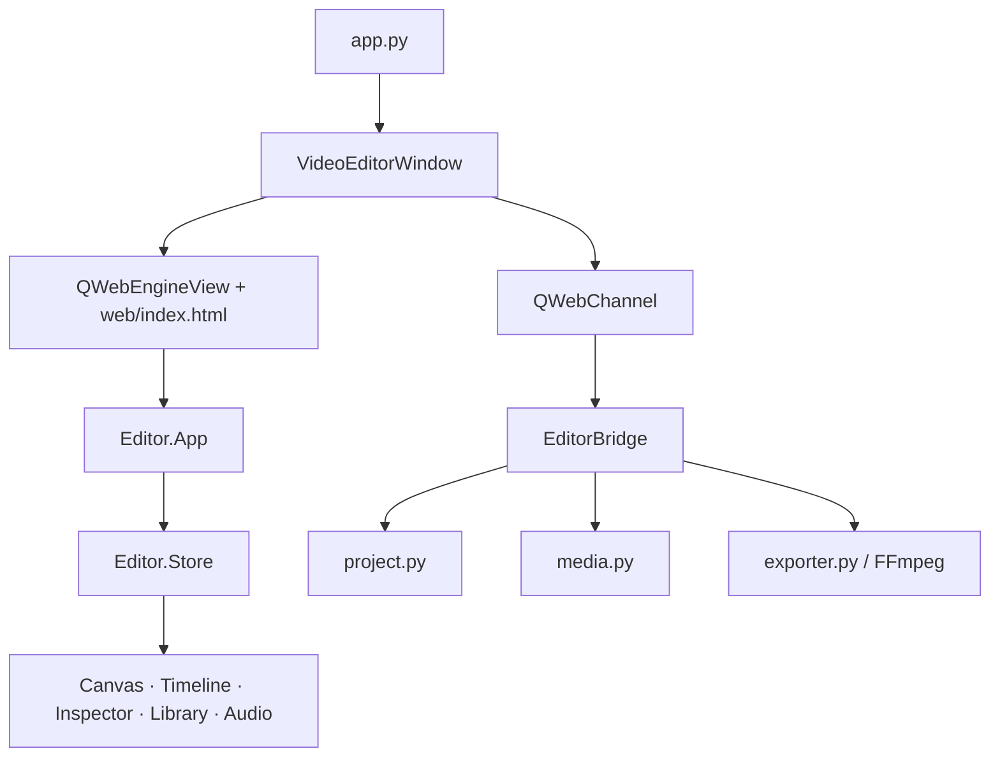
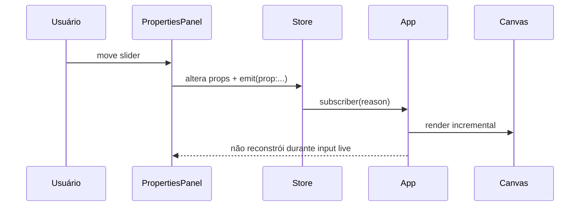
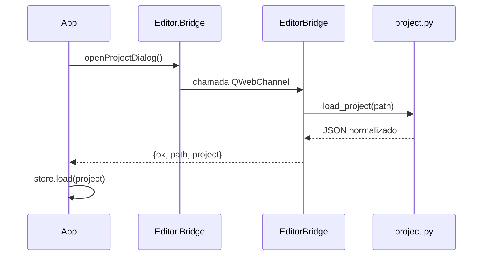

# Arquitetura e fluxo de dados

## Visão geral

O Lumi é um desktop app híbrido. PyQt6 fornece janela, filesystem, diálogos, drag-and-drop nativo e execução do FFmpeg. QWebEngine renderiza a interface local. O frontend mantém o estado de edição e desenha o preview.



## Boot da aplicação

1. `app.py` define flags Chromium antes de criar `QApplication`.
2. `VideoEditorWindow` cria o `DropWebEngineView` e configura recursos de WebEngine.
3. Um `EditorBridge` é registrado como `bridge` em `QWebChannel`.
4. A página local `web/index.html` é carregada.
5. Scripts IIFE populam `window.Editor` na ordem declarada no HTML.
6. Em `DOMContentLoaded`, `app.js` instancia Store e controllers.
7. Controllers registram listeners; o App assina o Store e executa `render("init")`.
8. `Editor.Bridge.ready` resolve quando o QWebChannel está disponível.

## Ordem dos scripts

A ordem é um contrato porque não há bundler/import map. As dependências precisam existir no namespace antes do consumidor:

```text
utils → bridge → easing → presets → state → svgLibrary
→ animationEngine → textAnimator → threeText3D → motionPathEditor
→ canvas → graphEditor → timeline → properties → mediaLibrary
→ audioEngine → effects → templates → exporter → panelDock → app
```

Adicionar um arquivo depois de `app.js` pode produzir erro apenas em runtime. Mantenha `app.js` por último.

## Fronteiras

### Camada Python

- `main_window.py`: ciclo de vida da janela e integração Qt.
- `bridge.py`: boundary serializável entre Python e JS.
- `project.py`: normalização e I/O de projeto.
- `media.py`: detecção, metadata e localização de FFmpeg/ffprobe.
- `exporter.py`: sessões temporárias, áudio e encoding.
- `paths.py`: diretórios graváveis do workspace.

Python não deve alterar regras de interação ou DOM.

### Camada web

- `state.js`: modelo e comandos.
- `app.js`: composição de controllers, render scheduler e atalhos.
- Controllers: uma área funcional cada.
- `styles.css`: tokens e estados; classes são parte do contrato com controllers.
- `web/index.html`: shell semântico e pontos de montagem.

Controllers podem consultar o Store e pedir comandos, mas não devem criar uma segunda cópia persistente do projeto.

## Fluxos principais

### Mudar uma propriedade



### Abrir projeto



## Modelo de atualização

`Store.emit(reason)` notifica `App.render(reason)`. A reason determina o custo:

- `time`: canvas, playhead e sincronização de áudio.
- `timeline:drag-live` / `canvas:drag-live`: canvas e playhead; DOM pesado é preservado.
- `prop:*`: preview live, sem recriar o inspetor enquanto o slider está em uso.
- Mudanças estruturais como `layer:add`, `load` e `undo`: render completo dos controllers necessários.

Ao criar uma reason nova, classifique-a em `App.render`; deixar cair no caminho genérico pode causar jank.

## Contratos de erro

As chamadas nativas devolvem JSON no formato:

```json
{ "ok": true, "path": "..." }
```

ou:

```json
{ "ok": false, "error": "mensagem" }
```

`Editor.Bridge.call()` também oferece fallback web/localStorage quando não está dentro do Qt. Controllers não devem depender de objetos PyQt diretamente.

## Dívidas arquiteturais atuais

- Scripts globais sem módulos ES ou TypeScript.
- Dois defaults de projeto, em Python e JS, que precisam ser mantidos alinhados.
- Render scheduler baseado em strings, sem enum/dirty flags tipadas.
- Exportação de frames passa data URL pelo QWebChannel.
- Controllers grandes (`canvas.js`, `properties.js`, `mediaLibrary.js`, `templates.js`).
- Algumas capacidades de preview são mais completas que a paridade de exportação.

